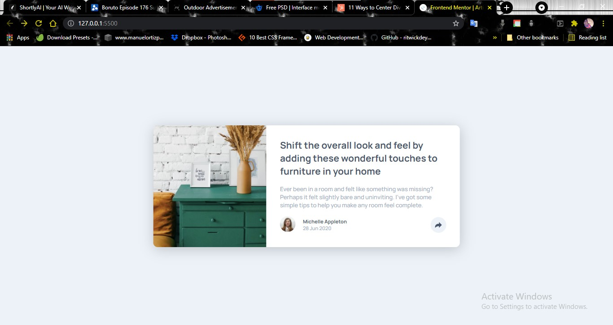
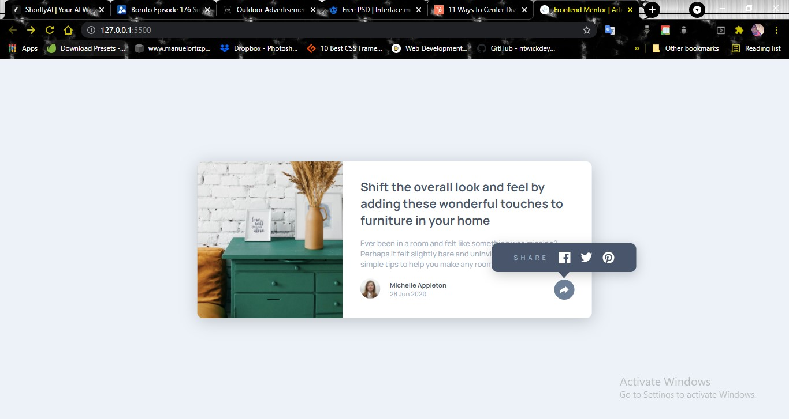

 ## Table of contents

- [Overview](#overview)
  - [The challenge](#the-challenge)
  - [Screenshot](#screenshot)
  - [Links](#links)
  - [Built with](#built-with)
  - [Continued development](#continued-development)
  - [Useful resources](#useful-resources)
- [Author](#author)

## Overview
This is a solution to the [Article preview component challenge on Frontend Mentor](https://www.frontendmentor.io/challenges/article-preview-component-dYBN_pYFT). Frontend Mentor challenges help you improve your coding skills by building realistic projects. 

### The challenge

Users should be able to:

- View the optimal layout for the component depending on their device's screen size
- See the social media share links when they click the share icon

### Screenshot

<<<<<<< HEAD

=======
(./images/article-webpage.jpg)
(./images/article-active-state.jpg)
>>>>>>> 46ca29fb4916ddc9e72b37b52bcccbc08ba0ca25

### Links

- Solution URL: [Github repo](https://github.com/samzyconcepts/article-preview)
- Live Site URL: [Live Site](https://article-preview-samzyconcepts.vercel.app)

### Built with

- Semantic HTML5 markup
- CSS custom properties
- Flexbox
- Vanilla Javascript

### Continued development

Yeah!! I will like to refine my Javascript, I need some ways to refactor my javascript code.
A little patch up on my css...

## Author

- Frontend Mentor - [@samzyconcepts](https://www.frontendmentor.io/profile/samzyconcepts)
- Twitter - [@samzyconcepts_](https://www.twitter.com/samzyconcepts_)
